# Catppuccin Latte

A warm, readable Catppuccin Latte theme for Omarchy: porcelain surfaces, lavender selections, and softer window borders. Ten futuristic outdoor scenes mix daylight with deep slate nights, followed by a flowing pastel design and the Omarchy wordmark.

## Default desktop — Latte Observatory

[](preview.png)

[Full-resolution desktop preview](preview.png): four tiled Foot windows with Neovim, btop, Lazygit, and a shell showing Fastfetch and the palette. Captured at 5120 × 2880 with the existing 2× display scale and 9 pt terminal font. Neovim and Lazygit show a small sample Python project.

## Install

```bash
omarchy theme install https://github.com/ryanyogan/omarchy-catppuccin-latte-theme
```

Or paste that URL into **Install → Style → Theme**. The installed name is **catppuccin-latte**. It occupies the same theme slot as Omarchy's bundled Latte; installing requires that the user theme directory is available. Back up any existing personal Latte customization first.

Cycle the wallpapers with `omarchy theme bg next`.

## Appearance

The base is `#eeebed`, a slightly warmer adaptation of Latte's porcelain. Text stays `#4c4f69`; small-text accents are deeper versions of the original hues. The checked base text/accent pairs exceed 5.4:1 contrast. Selections use `#dcddeb` with dark text. Window borders use nearby lavender-grey tones: `#8c91b5` active and `#a9adbf` inactive.

The bar surface is transparent by default. Enable Omarchy's **transparent bar** toggle once to also enable its wallpaper-aware icon/text colors; that setting belongs to your shell preferences, which a color-only theme cannot change. It selects dark ink on the nine light backgrounds and porcelain on the three dark skies. Latte Observatory is the default wallpaper, opening the collection with a light mountain sky. Menus, tooltips, notifications and lock input remain readable light surfaces.

## App coverage

`mode = "light"` and `colors.toml` drive Omarchy's standard terminal, editor, browser, GTK light-mode and shell integrations. Color-only refinements are included for btop, Claude, Pi, Hermes, T3 Code, VS Code and Obsidian. File-manager icons use Yaru Purple.

The repository follows [Omarchy's theme distribution rules](https://omarchy.org/manual/making-your-own-theme/). It does not ship executable root-level Lua, terminal configuration files, or `vscode.json`. Omarchy generates those, or inherits its bundled configuration for this theme name. In particular, Neovim uses the bundled Catppuccin Latte integration when available; otherwise it uses Omarchy's generated editor theme.

Some applications need their system theme selected once: Claude's `custom:omarchy`, Pi's `omarchy-system`, Hermes's `omarchy` skin, and OpenCode's `system` theme. Codex has a separate syntax theme: choose `catppuccin-latte` with `/theme`. For Herdr, use the [optional palette template and sync hook](extras/README.md#herdr): host-based automatic switching can leave dark tab and selection bars inside a light terminal. Zed's optional Omazed integration must be selected in Zed after it generates the palette.

[Optional app refinements](extras/README.md) add softer terminal searches, tmux selections, Herdr UI colors, Lazygit/Lazydocker panels, and Neovim search highlights through Omarchy's documented **user templates**, a local Herdr sync hook, and a local Neovim highlight recipe. They are opt-in and are not executed or installed by cloning the theme. The preview was captured with the terminal, tmux, Lazygit/Lazydocker and Neovim refinements enabled.

## Wallpapers

Twelve included backgrounds span bright alpine landscapes, dark futuristic cities, racing circuits, and soft pastel ribbons. **Latte Observatory is the default.**

<details>
<summary><strong>Explore all 12 included backgrounds</strong></summary>

The backgrounds appear in this order. Click any preview to open its full image.

| | |
| --- | --- |
| **01 · Latte Observatory · default**<br>[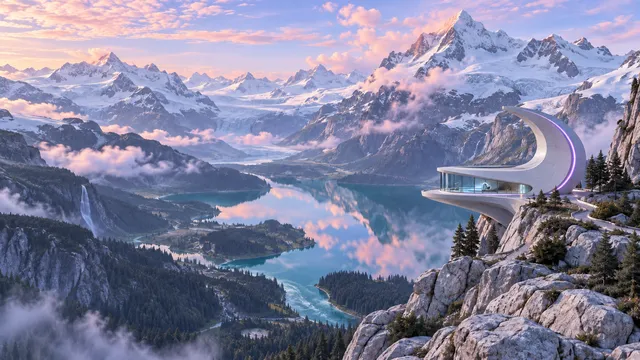](backgrounds/001-latte-observatory.png) | **02 · Circuit City · optional AI-reactive glow**<br>[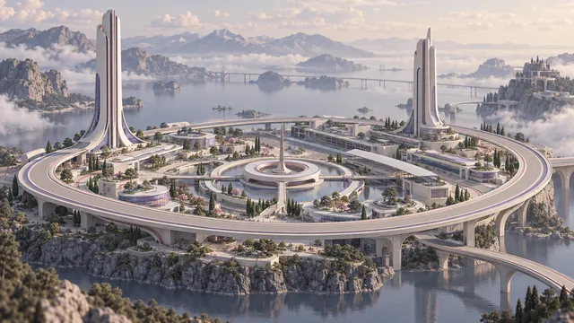](backgrounds/002-circuit-city.png) |
| **03 · Alpine Circuit**<br>[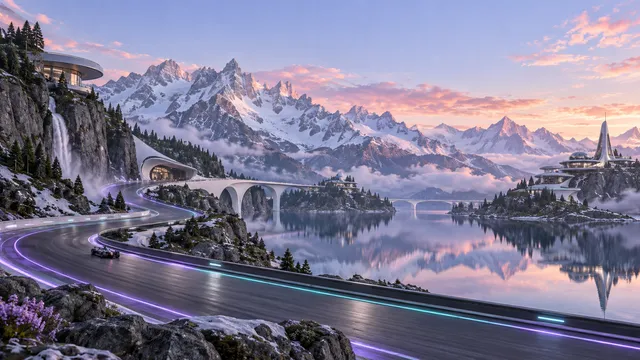](backgrounds/003-alpine-circuit.png) | **04 · Mesa Reverie**<br>[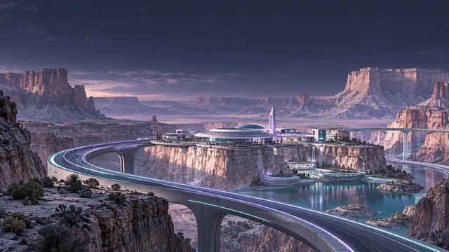](backgrounds/004-mesa-reverie.png) |
| **05 · Midnight Fjord**<br>[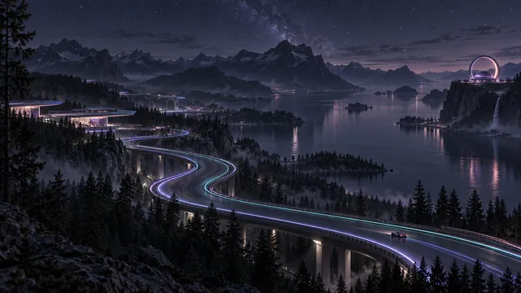](backgrounds/005-midnight-fjord.png) | **06 · Quattro Futures**<br>[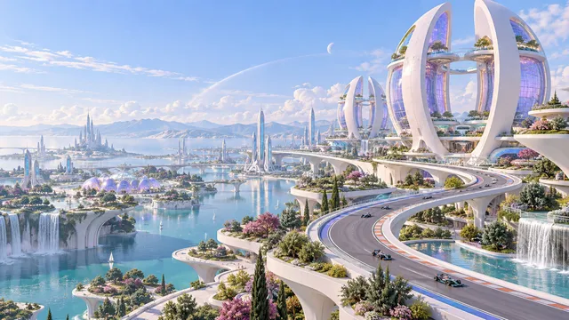](backgrounds/006-quattro-futures.png) |
| **07 · Mesa Afterlight**<br>[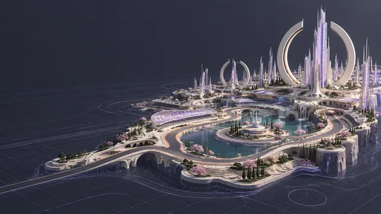](backgrounds/007-mesa-afterlight.png) | **08 · Mesa City Grid**<br>[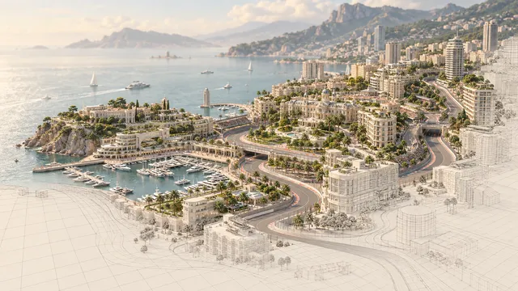](backgrounds/008-mesa-city-grid.png) |
| **09 · Quattro Park**<br>[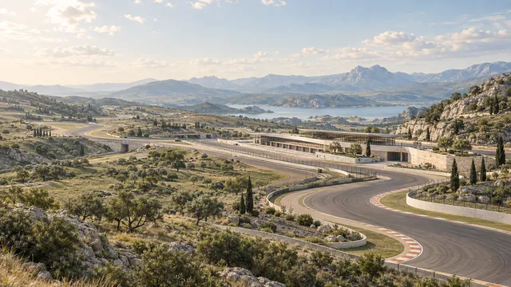](backgrounds/009-quattro-park.png) | **10 · Garden City**<br>[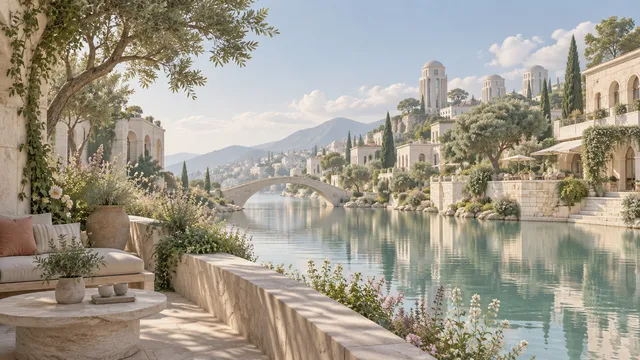](backgrounds/010-garden-city.png) |
| **11 · Pastel Flow**<br>[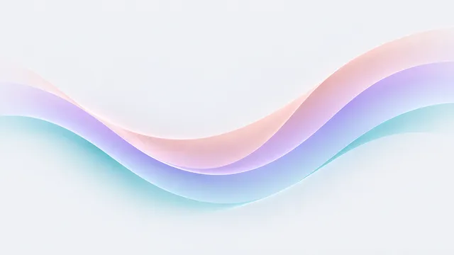](backgrounds/1-color-fade.png) | **12 · Omarchy**<br>[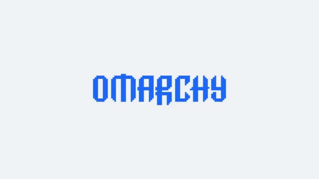](backgrounds/omarchy.png) |

</details>

Circuit City also has an [optional AI-reactive glow](docs/reactive-background.md): rosewater for Claude and lavender for Codex activity. This requires a separate background integration; the theme alone displays the static wallpaper.

Three-digit scene prefixes keep Pastel Flow and the bundled Omarchy wallpaper last in Omarchy’s alphabetical ordering. The pastel retains the upstream filename so it replaces the bundled gradient without creating a duplicate.

The new wallpapers were made with the built-in image generator. They are 1672 × 941 originals, not native 4K images. [Landscape prompts and mountain recolor instructions](docs/wallpaper-prompts.md) and the [Pastel Flow redesign prompt](docs/pastel-flow-prompt.md) are included.

## Verification and credits

See the [app audit](docs/app-audit.md), [contrast measurements](docs/contrast.json), and [portable configuration inventory](docs/portable-configs.json). The portable theme was staged using Omarchy's installed-theme filter and rendered without personal templates. No supplied files were rejected. Live checks cover the apps listed in the audit; application-owned or hard-coded colors can still override a terminal palette.

Based on [Catppuccin Latte](https://catppuccin.com/palette/), with adapted surfaces and accents. This is a community adaptation, not an official Catppuccin release. Theme configuration is MIT licensed; Catppuccin's license is preserved in [docs/CATPPUCCIN-LICENSE](docs/CATPPUCCIN-LICENSE). The original generated wallpapers are included for use and redistribution with this theme. `backgrounds/omarchy.png` is the unchanged wallpaper from Omarchy’s bundled Catppuccin Latte theme.
