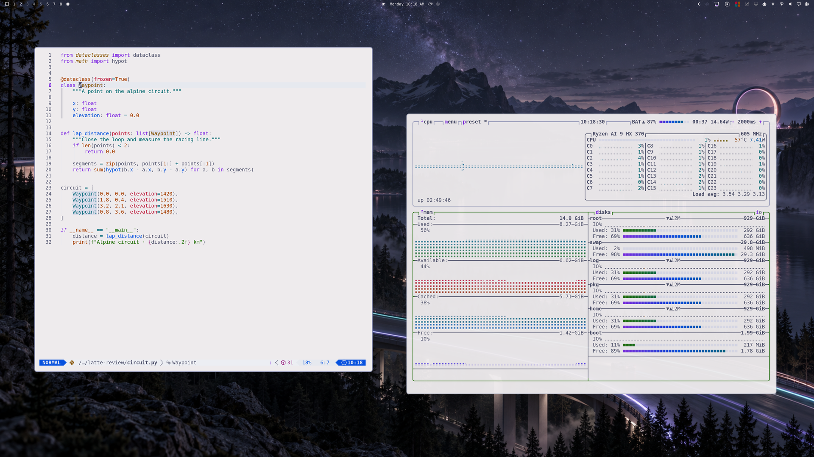

# Catppuccin Latte

A warm, readable Catppuccin Latte theme for Omarchy: porcelain surfaces, lavender selections, and softer window borders. Ten futuristic outdoor scenes mix daylight with deep slate nights, followed by a flowing pastel design and the Omarchy wordmark.



## Install

```bash
omarchy theme install https://github.com/ryanyogan/omarchy-catppuccin-latte-theme
```

Or paste that URL into **Install → Style → Theme**. The installed name is **catppuccin-latte**. It occupies the same theme slot as Omarchy's bundled Latte; installing requires that the user theme directory is available. Back up any existing personal Latte customization first.

Cycle the wallpapers with `omarchy theme bg next`.

## Appearance

The base is `#eeebed`, a slightly warmer adaptation of Latte's porcelain. Text stays `#4c4f69`; small-text accents are deeper versions of the original hues. The checked base text/accent pairs exceed 5.4:1 contrast. Selections use `#dcddeb` with dark text. Window borders use nearby lavender-grey tones: `#8c91b5` active and `#a9adbf` inactive.

The bar surface is transparent by default. Enable Omarchy's **transparent bar** toggle once to also enable its wallpaper-aware icon/text colors; that setting belongs to your shell preferences, which a color-only theme cannot change. It selects dark ink on the nine light backgrounds and porcelain on the three dark skies. Circuit City opens the collection with a light skyline. Menus, tooltips, notifications and lock input remain readable light surfaces.

## App coverage

`mode = "light"` and `colors.toml` drive Omarchy's standard terminal, editor, browser, GTK light-mode and shell integrations. Color-only refinements are included for btop, Claude, Pi, Hermes, T3 Code, VS Code and Obsidian. File-manager icons use Yaru Purple.

The repository follows [Omarchy's theme distribution rules](https://omarchy.org/manual/making-your-own-theme/). It does not ship executable root-level Lua, terminal configuration files, or `vscode.json`. Omarchy generates those, or inherits its bundled configuration for this theme name. In particular, Neovim uses the bundled Catppuccin Latte integration when available; otherwise it uses Omarchy's generated editor theme.

Some applications need their system theme selected once: Claude's `custom:omarchy`, Pi's `omarchy-system`, Hermes's `omarchy` skin, and OpenCode's `system` theme. Codex has a separate syntax theme: choose `catppuccin-latte` with `/theme`. Herdr supports automatic switching between `catppuccin-latte` and `catppuccin`; remove any old hard-coded black panel override. Zed's optional Omazed integration must be selected in Zed after it generates the palette.

[Optional app refinements](extras/README.md) add softer terminal searches, tmux selections, Lazygit/Lazydocker panels, and Neovim search highlights through Omarchy's documented **user templates** and a local Neovim highlight recipe. They are opt-in and are not executed or installed by cloning the theme. The preview was captured with these local refinements enabled.

## Wallpapers

| Order | File | Scene |
| --- | --- | --- |
| 1 | `001-circuit-city.png` | Futuristic city circuit |
| 2 | `002-alpine-circuit.png` | Lavender-lit alpine circuit and lake |
| 3 | `003-mesa-reverie.png` | Twilight desert research park |
| 4 | `004-latte-observatory.png` | Mountain observatory recolored into Latte |
| 5 | `005-midnight-fjord.png` | Dark forest, fjord and endurance circuit |
| 6 | `006-quattro-futures.png` | Porcelain racing metropolis in daylight |
| 7 | `007-mesa-afterlight.png` | Dark slate city simulation model |
| 8 | `008-mesa-city-grid.png` | Daylight city and terrain grid |
| 9 | `009-quattro-park.png` | Outdoor circuit through rolling parkland |
| 10 | `010-garden-city.png` | Canal, gardens and quiet architecture |
| 11 | `1-color-fade.png` | Pastel Flow — three luminous ribbons on porcelain |
| 12 | `omarchy.png` | Bundled Omarchy wordmark |

Three-digit scene prefixes keep Pastel Flow and the bundled Omarchy wallpaper last in Omarchy’s alphabetical ordering. The pastel retains the upstream filename so it replaces the bundled gradient without creating a duplicate.

The new wallpapers were made with the built-in image generator. They are 1672 × 941 originals, not native 4K images. [Landscape prompts and mountain recolor instructions](docs/wallpaper-prompts.md) and the [Pastel Flow redesign prompt](docs/pastel-flow-prompt.md) are included.

## Verification and credits

See the [app audit](docs/app-audit.md), [contrast measurements](docs/contrast.json), and [portable configuration inventory](docs/portable-configs.json). The portable theme was staged using Omarchy's installed-theme filter and rendered without personal templates. No supplied files were rejected. Live checks cover the apps listed in the audit; application-owned or hard-coded colors can still override a terminal palette.

Based on [Catppuccin Latte](https://catppuccin.com/palette/), with adapted surfaces and accents. This is a community adaptation, not an official Catppuccin release. Theme configuration is MIT licensed; Catppuccin's license is preserved in [docs/CATPPUCCIN-LICENSE](docs/CATPPUCCIN-LICENSE). The original generated wallpapers are included for use and redistribution with this theme. `backgrounds/omarchy.png` is the unchanged wallpaper from Omarchy’s bundled Catppuccin Latte theme.
